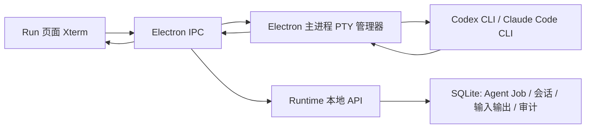

# 交互式 Agent 与终端体验设计

## 目标

将 Run 内的 Agent 从一次性批处理调用扩展为可治理的交互式会话：用户可直接在 Run 的 Xterm 日志区域回复 Codex CLI 或 Claude Code CLI，任务在同一运行中继续。终端模块同时改为单一、可直接输入的 Xterm 视图，解决重复日志、无限撑高和 Windows 中文乱码问题。

## 背景与根因

当前 Run Agent 通过 `codex exec --json` 或 `claude -p --output-format stream-json` 启动，Runtime 又将子进程标准输入设置为 `DEVNULL`。这类调用是一次性任务，不具备中途向原进程发送用户回复的能力。

当前终端页面将同一份 PTY 输出同时渲染为纯文本 `<pre>` 与 Xterm；纯文本区域没有最大高度，日志增长会持续撑高页面。Xterm 被配置为只读，用户只能在视窗外的输入框输入并点击发送。Windows PTY 和 Runtime 子进程输出也没有统一的 UTF-8 会话初始化与解码策略，因此中文输出可能显示为乱码。

## 范围

本次实现包含：

- Run Agent 的两种显式启动模式：交互式与自动执行。
- 交互式 Agent 在 Run 页面中以单一 Xterm 会话显示和直接输入。
- 用户输入、Agent 输出、状态变化和取消操作的持久化审计。
- Run Agent 日志、部署日志和终端日志的固定高度、滚动、自动跟随和未读提示。
- 终端模块移除重复纯文本日志，直接在 Xterm 内输入。
- Windows 下 Shell、Codex CLI、Claude Code CLI 的 UTF-8 会话与输出归一化。
- Runtime、Electron IPC、Renderer、迁移、单元测试和端到端回归。

本次不包含：

- 将供应商 CLI 的 TUI 控件逐像素解析为专用表单。
- 在应用或 Runtime 崩溃后复活原操作系统进程。崩溃恢复使用完整历史转录创建新的继续会话，不把它表述为原进程仍然存在。
- 绕过既有终端危险命令审批、路径限制、Runtime 本地认证或审计要求。

## 产品行为

### Agent 启动模式

Run 的“启动 Agent”默认选择“交互式”。用户可切换为“自动执行”：

| 模式 | 使用场景 | 执行方式 | 输入能力 |
| --- | --- | --- | --- |
| 交互式 | 编码、分析、需要澄清或确认的任务 | Electron 主进程以受控 PTY 启动 Provider CLI；Runtime 持久化会话与审计 | 始终可在 Xterm 中直接输入 |
| 自动执行 | 无需人工介入的批量任务、报告生成、后台检查 | Runtime 以现有 JSON 流式 CLI Executor 启动 | 不提供中途输入；需要对话时创建带转录的继续会话 |

交互式模式中，Agent 输出不依赖对“是否正在提问”的不可靠文本猜测。只要会话处于运行状态，Xterm 均可接受输入。界面显示“可直接回复”，而不是在没有供应商协议支持时虚构精确的“等待输入”状态。

### Run 页面

Agent 区域使用一个独立的会话工作区：

- 任务启动前保留 Provider、模式、节点和初始提示表单。
- 交互会话启动后，Xterm 成为唯一实时输出与输入界面；不显示额外的运行中输入框或“发送”按钮。
- 输入 `Enter` 直接发送给当前 PTY；`Ctrl+C` 请求中断；复制和粘贴保留。
- 会话标题显示 Provider、节点、模式、运行状态、开始时间和当前操作。
- 日志视窗高度固定在桌面端 420px 至 620px 的响应式范围，移动端为可用视口高度的一部分；内部滚动，永不推动整页无限变长。
- 默认自动跟随最新输出。用户上滚阅读历史时自动暂停跟随，并显示未读数量与“跳到最新”图标按钮。
- 自动执行 Agent、部署输出也使用同一类受限日志视窗，而非无限增长的 `<pre>`。
- 用户输入在视觉上由 Xterm 本身呈现，并在 Runtime 中以 `human_input` 事件持久化；不额外复制敏感输入到不必要的页面状态。

### 终端页面

终端模块只保留一个可输入 Xterm：

- 删除与 Xterm 重复的纯文本输出 `<pre>`。
- 点击 Xterm 即获得焦点；Shell 与 Codex 会话均由键盘直接输入。
- Shell 输入仍先通过主进程命令分析和高风险审批；高风险命令在确认后才写入 PTY。
- Codex 或 Claude 类型的交互会话输入按 Provider 会话规则写入 PTY，不伪装成 Shell 命令。
- 搜索、复制、粘贴、清屏显示、调整大小、停止、历史只读回放和 Evidence 导出继续可用。
- 历史会话为只读 Xterm，不提供输入；“基于此会话继续”创建新会话并保留历史引用。

## 架构与数据流

Electron 主进程负责 Windows PTY 的创建、写入、读取、大小调整和终止。Runtime 仍是治理和持久化的唯一事实来源：创建 Job、校验 Run 与节点、记录输入输出、保存状态和审计、提供历史读取与恢复诊断。

Renderer 不直接创建子进程，也不直接访问数据库。它经 IPC 操作 PTY，经 Runtime API 读取或写入受治理的会话记录。

### 交互会话生命周期

1. Renderer 请求 Runtime 创建交互式 Agent Job，提交 Run、节点、Provider、初始提示与可信人工 Actor。
2. Runtime 校验项目路径和 Provider，创建 `QUEUED` Job、交互会话记录、初始提示输入事件和审计记录。
3. Renderer 经 Electron IPC 请求创建受 Runtime Job 绑定的 PTY。主进程按 Provider 构造交互命令，并使用 UTF-8 环境启动。
4. 主进程返回本地会话 ID 和 PID；Renderer 通知 Runtime 标记 Job/会话为 `RUNNING`。
5. PTY 输出流经 IPC 到 Renderer；Renderer 批量写入 Runtime 输出 API，并实时写入 Xterm。
6. 用户在 Xterm 输入。对于 Provider 交互会话，Renderer 经 IPC 写入 PTY，同时将同一输入作为 `human_input` 事件提交 Runtime。
7. 退出、取消或异常终止时，主进程通知 Renderer，Runtime 写入最终 Job 状态、会话状态、摘要和审计。
8. Runtime 重启发现没有存活的桌面 PTY 绑定时，将会话标记为“可继续”，并保留完整转录。用户选择继续后创建新 PTY 与新 Job，初始提示包含安全截断后的原任务、关键输出和人工输入历史。

### 自动执行生命周期

自动执行沿用 Runtime 内的 `CliAgentExecutor` 与 JSON 流输出。其 Job 明确标记为 `automatic`。若用户希望在自动任务的结果基础上继续对话，界面创建新的交互式 Job，并由 Runtime 记录父 Job、转录范围和继续原因。

## 数据模型

迁移新增以下字段或表：

- `agent_jobs.mode`：`interactive` 或 `automatic`，默认 `automatic`，兼容已有记录。
- `agent_jobs.session_id`：交互会话 ID，可为空。
- `agent_jobs.parent_job_id`：继续会话的来源 Job，可为空。
- `agent_sessions`：`id`、`run_id`、`job_id`、`provider`、`status`、`desktop_session_id`、`pid`、`cwd`、`created_at`、`updated_at`、`ended_at`、`recovery_reason`。
- `agent_input_events`：`id`、`session_id`、`sequence`、`kind`（`initial_prompt` 或 `human_input`）、`content`、`created_at`。内容执行与终端输出一致的脱敏处理。

现有 `agent_output_events` 继续存储 Provider 输出；新增输出事件类型允许 `terminal_raw`，但 API 向 Renderer 返回稳定的 `kind`、`payload` 和 `sequence` 结构。

## API 与 IPC 契约

Runtime API 新增：

- `POST /runs/{runId}/agents`：请求新增 `mode`，默认 `automatic`。
- `POST /runs/{runId}/agents/{jobId}/interactive-session/start`：确认 Electron 已创建 PTY，写入 PID、本地会话 ID 和运行状态。
- `POST /runs/{runId}/agents/{jobId}/interactive-session/input`：记录已发送的人工输入并审计。
- `POST /runs/{runId}/agents/{jobId}/interactive-session/output`：批量持久化 PTY 输出。
- `POST /runs/{runId}/agents/{jobId}/interactive-session/ended`：写入完成、取消或失败状态。
- `GET /runs/{runId}/agents/{jobId}/interactive-session`：读取会话状态与恢复信息。
- `POST /runs/{runId}/agents/{jobId}/continue`：基于历史创建新的交互式 Job。

Electron IPC 新增或扩展：

- `agent-terminal:create`：按 `codex` 或 `claude` Provider 创建交互 PTY。
- `agent-terminal:write`：写入原始用户输入。
- `agent-terminal:read`：增量读取输出。
- `agent-terminal:resize`、`agent-terminal:interrupt`、`agent-terminal:stop`。

所有 IPC 参数均校验会话所属的 Run、项目根目录和允许的 Provider。Renderer 不能传入任意 Shell 命令替代 Provider 启动命令。

## 编码与输出策略

- Electron PTY 启动环境设置 `LANG=en_US.UTF-8`、`LC_ALL=en_US.UTF-8`、`PYTHONIOENCODING=utf-8`；在 Windows Shell 首次启动时执行 UTF-8 代码页初始化，且不将该初始化命令重复写入审计输出。
- Runtime 的批处理 Executor 保持 UTF-8 解码，并增加 Provider/Shell 输出编码回退策略，优先 UTF-8，必要时尝试 Windows 本地代码页，再以替换字符作为最后保障。
- Xterm 保留 ANSI 控制序列的原始渲染；用于 Evidence、搜索和持久化的文本先脱敏，再保留可读的 Unicode 文本。
- 测试覆盖 UTF-8 中文、Windows 本地代码页中文、ANSI 颜色转义、截断字符和无效字节。

## 安全、审计与错误处理

- 交互式 Agent 只允许 `codex` 和 `claude` Provider，命令由主进程内部构造。
- Shell 终端继续执行路径校验和高风险审批；直接 Xterm 输入不绕过审批。
- 用户输入、原始输出、错误摘要和 Evidence 均复用脱敏规则，不保存明文凭据。
- Runtime API 继续要求本地认证令牌与可信人工 Actor。
- PTY 创建失败、Runtime 写入失败、IPC 断开、Provider 非零退出和 Runtime 重启分别产生中文错误消息、可追溯审计记录和可恢复状态。
- 当输出超过既有上限时，会话停止接收新输出并记录 `AGENT_OUTPUT_LIMIT`；界面保留已持久化部分与错误原因。

## 测试与验收

### Runtime

- 交互式 Job 创建、会话启动、输入输出持久化、审计、完成、取消和恢复继续。
- 非交互 Job 保持既有 CLI 行为。
- 路径越界、未知 Provider、无可信 Actor、无效会话归属和重复结束请求均被拒绝。
- 脱敏、输出上限、UTF-8 与代码页回退。

### Electron

- 交互 PTY 使用正确 Provider 命令和 UTF-8 环境。
- 输入写入 PTY，输出按序读取，`Ctrl+C`、resize、stop 可靠。
- Shell 高风险审批在直接 Xterm 输入时仍生效。

### Renderer

- Run 交互 Agent 以 Xterm 呈现，输入框与发送按钮不再存在。
- 自动跟随、手动上滚暂停、未读计数和跳到最新。
- 输出视窗固定高度，长输出不改变页面高度。
- 终端页面只渲染一个输出视窗；直接键盘输入、复制、粘贴、搜索和历史只读回放正确。
- 中文、ANSI 输出和错误状态可读。

### 端到端

- Fake Codex/Claude 交互 Provider 提示用户输入，界面在同一 Run 内输入回复后任务完成。
- 打包 EXE 中验证 Run 交互会话、终端直接输入、中文输出、日志固定高度和危险 Shell 命令审批。
- 回归执行 `npm.cmd run verify`、生产构建、Windows 完整打包和已安装版端到端测试。

## 验收定义

用户在 Run 中以交互式模式启动 Agent 后，无需取消或新建 Agent，即可在 Agent Xterm 里输入回复并使同一任务继续。日志不会重复渲染或无限撑高；终端和 Agent 区都可读、可滚动、支持中文并保留治理审计。自动执行模式仍可用于非交互批处理，并明确展示其不支持中途对话的边界。
