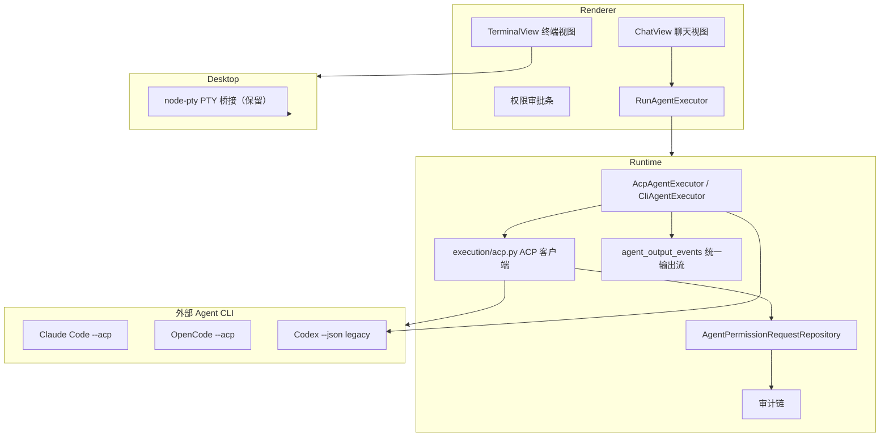

# Agent 运行时 ACP 适配与聊天交互设计规格

**状态：最终开发方案，可直接编码实施**

> 本文件是 Agent 运行时接入改造的唯一开发文档，范围覆盖 Runtime、Contracts、Renderer、Desktop。
> 改造目标是：新增 ACP 传输通道、权限审批闭环、聊天式多轮交互，同时完整保留现有自动执行与终端交互能力。

**初版日期：2026-08-10**
**修订日期：2026-08-11（v2，按当前 `main` 代码核对修订）**

**适用范围：Runtime、Contracts、Renderer、Desktop、外部 Agent CLI（Codex / Claude Code / OpenCode）**

> v2 修订摘要（对照当前 `main` 代码核对）：基线更新至 `b9e775d`；§0/§2 澄清错误处理现状（现有 `ValueError("AGENT_*: ...")` 带码字符串需先统一收编为 `RuntimeContractError`）；§4 契约补全现有 `StartAgentJobRequest` 字段、`permissionType` 枚举化、新增两个限额常量；§6.1/6.3 对齐现有 `CliAgentExecutor` 接口形状；§6.5 明确 `agent_input_events` 外键约束的落地方式；§6.6 定义 `AGENT_ACP_UNAVAILABLE` 状态码边界。

## 0. 最新代码基线与适配结论

本文基于 `main` 分支提交 `b9e775d`（`d6b02a6 feat: land run console agent terminal and concurrency work` 之后继续演进）核对。
`d6b02a6` 之后的漂移点：`e5361bb` 调整 Codex legacy `parse_line()` 输出文案（可读日志）；`9a35b7a` 让启动恢复/清理按 `purpose` 区分（知识任务恢复）；`60e192d`/`3300076`/`70269e4` 落地知识库持久化与 API。
编码时以实际合入后的最新代码为准；下列现有契约如果继续演进，必须先同步修订本文，不得在实现中静默保留第二套接口。

已确认的现状与适配决定：

1. Runtime 已有 `CliAgentExecutor`、`agent_jobs`、`agent_output_events`、交互式 `agent_sessions`/`agent_checkpoints`
   与 `continue_scoped_interactive_agent` 续话骨架。ACP 适配复用这些基础设施，不新建平行任务体系。
2. 自动模式当前通过 `CliProvider.build_command()` + `parse_line()` 直连各 CLI 私有输出（Codex `--json` 事件、
   Claude `-p` 文本）。该路径保留为 legacy 传输，ACP 作为新增传输通道并存。
3. 交互模式由桌面 `terminal.ts` 以 node-pty 启动 CLI TUI，Runtime 仅做输入/输出桥接。**首期不改造该通道**，
   终端视图保留，与聊天视图并存。
4. `agent_jobs` 已支持 `purpose`/`owner_id`/`metadata_json`（知识库 Task 2 已落地），ACP 会话 ID 与传输模式写入
   `metadata_json`，无需额外迁移列。
5. 审批、Gate、审计链（`governance/audit.py`）与 `RuntimeContractError` 错误包络保持不变；权限决定必须走现有审计链。
   注意：`start_agent_job` 目前对 mode 非法/未知节点/cwd 非法直接抛 `ValueError("AGENT_*: ...")` 带码字符串，
   并非全部经 `RuntimeContractError`；ACP 改造应先统一收编这些码，再新增 ACP 错误码。
6. Provider 枚举保持 `codex | claude | fake`（可扩展 `opencode`），新增独立维度 `transport: auto | cli | acp`，
   避免破坏现有契约与测试。
7. ACP 支持度存在不确定性（尤其 Codex），由 Phase 0 spike 定范围；不支持的 provider 在 `transport=acp` 时返回
   `AGENT_ACP_UNAVAILABLE`，默认 `auto` 自动回退 legacy。

## 1. 背景与目标

当前 Agent 执行存在三个可改进点：

- **协议脆弱**：自动模式依赖各家 CLI 私有输出格式，CLI 版本升级可能破坏解析；
- **权限不可控**：交互模式的工具调用由 CLI 自身确认（`terminal.ts` 中“工具调用仍使用 CLI 自身的确认策略”），
  软件看不到、无法审批、无法审计；
- **交互形态单一**：只有终端 TUI 和一次性自动任务，缺少结构化、可审批、可审计的聊天式交互。

本方案通过引入 ACP（Agent Client Protocol，JSON-RPC over stdio）解决协议标准化问题，并把权限请求接入现有
审批/审计体系，同时交付聊天式多轮交互界面。

### 1.1 目标

1. 新增 ACP 传输通道，自动执行可走 ACP；
2. Agent 权限请求（写文件、执行命令、网络等）进入软件审批闭环，决定写入审计链；
3. 交付聊天式多轮交互界面（ChatView），与终端视图、自动模式三态并存；
4. 全部现有功能零回归。

### 1.2 非目标

- 不更换终端组件（node-pty / @xterm/xterm 保留）；
- 不重写 Run 状态机、事件溯源、审计链、SQLite 存储；
- 首期不改造交互式 PTY 通道（终端视图原样保留）；
- 首期不做 SDK/API 直连（Phase 4 可选）；
- 不引入 LangGraph 等外部编排框架。

## 2. 关键设计决策

| 决策 | 结论 |
| --- | --- |
| Provider 标识 | 保持不变（`codex | claude | fake`，扩展 `opencode`） |
| 传输维度 | 新增 `transport: "auto" | "cli" | "acp"`，默认 `auto` |
| auto 语义 | 支持 ACP 的 provider 走 ACP；否则回退 legacy CLI |
| ACP 首期范围 | Claude Code（`--acp`）、OpenCode；Codex 视 Phase 0 探测结果，不支持则继续 legacy |
| 权限落点 | 新建 job 级 `agent_permission_requests` 表，不加入 `RUN_STATE_TABLES_CHILD_FIRST` |
| 聊天交互 | 多轮会话 job（`AWAITING_INPUT`）+ 续话 API + ChatView，Phase 3 交付 |
| 事件复用 | ACP turn/message/tool/permission 映射到 `agent_output_events` 的 `kind`，UI 复用现有输出轮询 |
| 错误处理 | 新增错误码，全部走 `RuntimeContractError` 包络；实施前先统一收编现有 `ValueError("AGENT_*: ...")` 带码字符串，不再新增第二套错误映射 |

## 3. 总体架构



三态交互：

- 自动模式：一次性 job（`transport=auto/cli/acp`），无人工参与，结束后关闭；
- 聊天模式：多轮会话 job（`AWAITING_INPUT`），ChatView 中连续对话，权限内嵌审批；
- 终端模式：PTY + CLI TUI，原样保留，可切换查看。

## 4. Contracts 变更

新建 `packages/contracts/src/agent.ts`，并在 `index.ts` 导出：

```ts
export const AGENT_TRANSPORTS = ["auto", "cli", "acp"] as const;
export type AgentTransport = (typeof AGENT_TRANSPORTS)[number];

export const AGENT_PERMISSION_STATUSES = ["PENDING", "ALLOWED", "DENIED", "EXPIRED"] as const;
export type AgentPermissionStatus = (typeof AGENT_PERMISSION_STATUSES)[number];

export const AGENT_PERMISSION_TYPES = [
  "write_file",
  "run_command",
  "network",
  "read_file",
  "env",
  "other",
] as const;
export type AgentPermissionType = (typeof AGENT_PERMISSION_TYPES)[number];

// 限额常量（§12 风险兜底）
export const AGENT_PERMISSION_PENDING_LIMIT = 50;   // 每 job PENDING 上限，超出自动 DENY 并审计
export const AGENT_AWAITING_INPUT_MAX_HOURS = 24;   // 聊天 job 最大挂起时长，超时转 FAILED 并审计

export type AgentPermissionRequest = {
  id: string;
  jobId: string;
  runId: string;
  permissionType: AgentPermissionType;
  target: string;              // 文件路径 / 命令文本（脱敏后）
  details: Record<string, unknown>;
  status: AgentPermissionStatus;
  decidedBy: Actor | null;
  decidedAt: string | null;
  decisionReason: string | null;
  createdAt: string;
  updatedAt: string;
};

// 启动 Agent 请求体扩展（向后兼容，字段可选；与现有 StartAgentJobRequest 对齐）
export type StartAgentRequest = {
  nodeId: string;
  provider: "codex" | "claude" | "opencode" | "fake";
  mode: "automatic" | "interactive";
  transport?: AgentTransport;   // 默认 "auto"
  prompt?: string;
  cwd?: string;                 // 与现有字段一致
  allowedTools?: string[];      // 与现有字段一致
  timeoutSeconds?: number;      // 默认 300
  maxOutputBytes?: number;      // 默认 1_000_000
  actor: Actor;
  now: string;
};

// 聊天续话请求/响应
export type ContinueConversationRequest = {
  message: string;
  actor: Actor;
  now: string;
};
export type ContinueConversationQueued = {
  turnId: string;
  status: "RUNNING";
};

// 权限决定请求/响应
export type DecidePermissionRequest = {
  decision: "allow" | "deny";
  reason?: string;
  actor: Actor;
  now: string;
};
```

`errors.ts` 追加错误码（按顺序）：

```text
AGENT_PERMISSION_NOT_FOUND_IN_RUN
AGENT_PERMISSION_ALREADY_DECIDED
AGENT_PERMISSION_EXPIRED
AGENT_ACP_UNAVAILABLE
```

## 5. 数据模型

在 `persistence/migrations.py` 的 `_migrate_schema` 中追加（不加入 `RUN_STATE_TABLES_CHILD_FIRST`）：

```sql
CREATE TABLE IF NOT EXISTS agent_permission_requests (
  id TEXT PRIMARY KEY,
  job_id TEXT NOT NULL REFERENCES agent_jobs(id) ON DELETE CASCADE,
  run_id TEXT NOT NULL,
  permission_type TEXT NOT NULL,
  target TEXT NOT NULL,
  details_json TEXT NOT NULL,
  status TEXT NOT NULL CHECK (status IN ('PENDING','ALLOWED','DENIED','EXPIRED')),
  decided_by_json TEXT,
  decided_at TEXT,
  decision_reason TEXT,
  created_at TEXT NOT NULL,
  updated_at TEXT NOT NULL
);
CREATE INDEX IF NOT EXISTS idx_agent_permission_requests_job_status
  ON agent_permission_requests(job_id, status, created_at, id);
CREATE INDEX IF NOT EXISTS idx_agent_permission_requests_run_status
  ON agent_permission_requests(run_id, status, created_at, id);
```

`agent_jobs.metadata_json` 新增受控字段（不迁移）：

- `transport`: "cli" | "acp"；
- `acpSessionId`: ACP 会话 ID（仅 acp）；
- `conversational`: true（聊天模式 job）；
- 已有字段保持（`repositoryId`/`snapshotId` 等互不冲突）。

## 6. Runtime 模块

### 6.1 `execution/acp.py`（新建）

```python
class AcpSession:
    def __init__(self, executable: str, args: list[str], *, cwd: Path, env: dict[str, str]): ...
    def start(self) -> None: ...                              # spawn 子进程，初始化 JSON-RPC
    def new_session(self, config: dict) -> str: ...           # 返回 session_id
    def send_turn(self, prompt: str, *, session_id: str) -> str: ...       # 新 turn
    def continue_turn(self, turn_id: str, message: str) -> str: ...        # 同 turn 续话
    def request_permission_response(self, request_id: str, *, allow: bool, reason: str | None) -> None: ...
    def close(self) -> None: ...
    def is_alive(self) -> bool: ...

class AcpEventReader:
    """后台线程读取 stdout JSON-RPC 通知，分发 on_event。
    事件：session.started / turn.started / message / tool_execution.started
         / tool_execution.completed / permission.request / turn.completed
         / session.finished / error"""
    def start(self, on_event: Callable[[dict], None]) -> None: ...
    def stop(self) -> None: ...

def build_acp_command(provider: str, *, cwd: Path) -> CliCommand:
    # claude.cmd --acp / opencode.cmd --acp（Phase 0 确认实际参数）...

def acp_event_to_agent_output(event: dict) -> dict:
    """ACP 事件 → { kind, payload }；kind 使用：
       acp.turn / acp.message / acp.tool / acp.permission / acp.error / acp.raw"""
    ...
```

### 6.2 `execution/providers.py`（修改）

`CliProvider` 保持不动（legacy）。新增：

```python
class AcpProvider(Protocol):
    id: str
    def build_acp_command(self, *, cwd: Path) -> CliCommand: ...
    def map_permission(self, request: dict) -> dict:
        """ACP permission.request → AgentPermissionRequest 字段"""
        ...
```

### 6.3 `execution/cli.py`（修改）

新增 `AcpAgentExecutor`（旧 `CliAgentExecutor` 零改动）：

```python
class AcpAgentExecutor:
    """与现有 CliAgentExecutor 保持同一形状：构造时注入 provider/回调，run() 返回执行结果。"""
    def __init__(self, *, provider: AcpProvider,
                 on_output: Callable[[dict], None] | None = None,
                 on_started: Callable[[int], None] | None = None,
                 extra_environment: dict[str, str] | None = None): ...
    def run(self, *, job_id: str, prompt: str, cwd: Path, project_root: Path,
            timeout_seconds: float, max_output_bytes: int,
            conversational: bool = False) -> CliExecutionResult: ...
    def continue_conversation(self, job_id: str, message: str) -> None: ...
    def decide_permission(self, request_id: str, *, allow: bool, reason: str | None) -> None: ...
    def cancel(self, job_id: str) -> bool: ...
```

### 6.4 `persistence/repositories.py`（修改）

```python
class AgentPermissionRequestRepository:
    def create(self, *, id, job_id, run_id, permission_type, target, details, created_at) -> None: ...
    def get(self, id: str) -> dict | None: ...
    def list_pending_for_job(self, job_id: str) -> list[dict]: ...
    def list_for_run(self, run_id: str, *, status: str | None = None) -> list[dict]: ...
    def decide(self, id: str, *, status: str, decided_by: dict, decided_at: str, reason: str | None) -> None: ...
    def expire_pending_for_job(self, job_id: str, *, expired_at: str) -> int: ...
```

### 6.5 `runtime_service.py`（修改）

```python
def start_agent_job(self, project_id, run_id, *, node_id, provider, prompt, mode,
                    transport="auto", conversational=False, actor, now,
                    session_id=None, parent_job_id=None) -> dict: ...
def list_agent_permissions(self, project_id, run_id, job_id, *, status="PENDING") -> list[dict]: ...
def decide_agent_permission(self, project_id, run_id, job_id, permission_request_id, *,
                            decision: str, reason: str | None, actor, expected_revision, now) -> dict: ...
def continue_agent_conversation(self, project_id, run_id, job_id, *,
                                message: str, actor, expected_revision, now) -> dict: ...
```

规则：

- 启动：先把 `start_agent_job` 现有 `ValueError("AGENT_*: ...")` 收编为 `RuntimeContractError`，再校验归属与并发后创建 job；
  `transport` 与 ACP session ID 写入 `metadata_json`；`conversational=True` 时 job 完成后进入
  `AWAITING_INPUT`（不结束），等待续话或显式结束；
- 权限：`decide_agent_permission` 必须校验 job 归属（`get_owned`）、请求状态为 `PENDING`、Actor 为可信人工；
  决定写入 `agent_permission_requests.decide` + 审计 `agent.permission.allowed|denied` + 输出事件
  `acp.permission.decided`，同一 SQLite 短事务；重复决定返回 409 `AGENT_PERMISSION_ALREADY_DECIDED`；
- 续话：`continue_agent_conversation` 校验 job 属于该 Run 且状态为 `AWAITING_INPUT`；消息写入
  `agent_input_events`，输出继续走 `agent_output_events` 轮询；返回 `{ turnId, status: "RUNNING" }`；
  落库约束：`agent_input_events` 目前以 `agent_sessions(id)` 为外键（交互 PTY 专用），聊天 job 启动时
  必须同时创建一条 `agent_sessions` 记录（`kind='acp-chat'`、`desktop_session_id=NULL`），或按 Phase 3
  放宽外键；禁止直接写入无 session 的行，`record` 端继续按 `get_owned` 校验 job 归属；
- 结束：聊天 job 通过现有 `finish_scoped_interactive_agent_session` 语义或 ACP `session.finished` 事件结束；
  结束时把该 job 全部 PENDING 权限置为 `EXPIRED`；
- 并发：`count_active_by_purpose`/`_assert_agent_concurrency` 只统计 `QUEUED/RUNNING`，
  `AWAITING_INPUT` 不计入活动 Agent 并发；
- orphan 检测：`cleanup_scoped_orphan_agent_jobs` 排除 `AWAITING_INPUT`（有意挂起，非悬挂）；
  现有清理已按 `purpose` 区分（知识任务启动恢复），聊天判定复用同一函数，不另起一套。

### 6.6 `api/app.py`（修改）

```text
POST /projects/{projectId}/runs/{runId}/agents                       # 请求体加 transport/conversational（可选）
GET  /projects/{projectId}/runs/{runId}/agents/{jobId}/permissions?status=PENDING
POST /projects/{projectId}/runs/{runId}/agents/{jobId}/permissions/{requestId}/decide
POST /projects/{projectId}/runs/{runId}/agents/{jobId}/conversation/message
```

权限决定请求：

```json
{ "decision": "allow" | "deny", "reason": "可选", "actor": { ...trustedHuman }, "now": "..." }
```

续话请求：

```json
{ "message": "继续，按刚才的方案改", "actor": { ...trustedHuman }, "now": "..." }
```

错误码边界：`AGENT_ACP_UNAVAILABLE` 仅在 provider 不支持 ACP 时返回 422；provider 未安装或诊断失败时
沿用现有 provider 诊断语义（404/503），不混用。

## 7. 聊天交互规格（ChatView）

### 7.1 形态

ChatView 是聊天模式 job 的默认视图，与终端视图、会话视图并列切换：

```
┌──────────────────────────────────────────────┐
│ Job: kb-4f2a · provider: claude · 聊天 [终端] │
├──────────────────────────────────────────────┤
│ 你：帮我实现登录接口                            │
│ Agent：好的，我来实现……（流式输出中）            │
│ Agent：需要写 auth.ts，是否允许？               │
│   [ 允许 ]  [ 拒绝 ]      ← 权限审批条          │
│ 你：允许，顺便加上单元测试                      │
│ Agent：已完成，测试通过 ✅                      │
├──────────────────────────────────────────────┤
│ [输入框……………………………………] [发送]            │
└──────────────────────────────────────────────┘
```

### 7.2 数据流

- 消息/工具/权限统一经 `agent_output_events`（kind：`acp.turn`、`acp.message`、`acp.tool`、
  `acp.permission`、`acp.error`）推送到现有输出轮询；
- `runAgentExecutorModel` 按 kind 分类：`acp.message` 追加消息流，`acp.tool` 进工具卡片列表，
  `acp.permission` 进 `pendingPermissions`；
- 发送消息调用 `conversation/message`，成功后轮询继续；
- 权限决定调用 `permissions/{requestId}/decide`，成功移除审批条并显示审计回执（`agent.permission.*`）。

### 7.3 空态与异常

- 无活动 job：ChatView 显示空态，不渲染输入框；
- 输出轮询失败：保留当前消息流，显示可重试错误条，不丢已收消息；
- 权限决定失败（409 已决定/过期）：刷新权限列表并同步状态；
- job 结束（`session.finished`/FAILED）：输入框禁用，展示结束原因，PENDING 权限显示"已过期"。

## 8. Renderer / Desktop 变更

- `apps/renderer/src/features/runs/runAgentExecutorModel.ts`：按 kind 分类（消息/工具/权限），
  新增 `pendingPermissions`、`conversationDisabled` 状态；
- `apps/renderer/src/features/runs/RunAgentExecutor.tsx`：新增 ChatView 与权限审批条；
  终端 Tab 保留，聊天/会话/终端三 Tab 切换；
- `apps/renderer/src/features/runs/RunAgentIdentity.ts`：`opencode` 图标/代号（可选）；
- `apps/desktop/src/preload/global.d.ts` / `preload.cts`：无需新增 IPC（全部走 `window.workflowRuntime.request`）；
- `apps/desktop/src/main/terminal.ts`：不改（交互 PTY 保留）。

## 9. 测试策略

| 文件 | 覆盖 |
| --- | --- |
| `runtime/tests/test_acp_client.py`（新建） | 用假 ACP 进程（stdio 双向管道）模拟 JSON-RPC：session/turn/message/tool/permission/error/超时/断连 |
| `runtime/tests/test_agent_permissions.py`（新建） | 权限创建→列表→allow/deny→审计→重复决定 409→job 结束 EXPIRED |
| `runtime/tests/test_agent_conversation.py`（新建） | 聊天 job：启动→`AWAITING_INPUT`→续话→消息入 `agent_input_events`→输出轮询→结束→PENDING 过期 |
| `runtime/tests/test_api.py`（修改） | transport 默认 auto 兼容；`transport=acp` 对 fake 返回 422 `AGENT_ACP_UNAVAILABLE`；权限与续话端点作用域校验 |
| `runtime/tests/test_runtime_service.py`（修改） | legacy 路径零回归；orphan 检测排除 `AWAITING_INPUT` |
| `apps/renderer/.../runAgentExecutorModel.test.ts`（修改） | acp.message/tool/permission 分类、权限决定后清除、错误态 |
| `apps/renderer/.../RunAgentExecutor.test.tsx`（修改） | ChatView 渲染、输入发送、审批条 allow/deny、结束禁用输入 |
| `tests/e2e/workflow-product-loop.spec.ts`（修改） | fake 聊天流程：启动→续话→权限审批→审计可见 |

Fake Provider 必须继续通过 `CliProvider` legacy 路径运行（不引入 ACP），保证测试确定性。

## 10. 分阶段执行与提交顺序

```
Phase 0  spike：探测 claude --acp / opencode --acp / codex 支持度与参数（半天）
Phase 1  ACP 自动模式：acp.py + AcpAgentExecutor + transport 参数 + fake 测试（1~1.5 周）
Phase 2  权限审批闭环：表 + Repository + API + 审计 + UI 审批条（3~4 天）
Phase 3  聊天交互：AWAITING_INPUT job + 续话 API + ChatView（3~5 天）
Phase 4  可选：registry 健康检查 + SDK/API 直连（后置，需另行修订本文）
```

提交顺序：

```text
feat: add agent transport contract
feat: add acp agent executor
feat: add agent permission approval loop
feat: add agent conversation chat
feat: add agent permission and chat workbench
test: cover acp permission and conversation flows
```

提交不得包含现有无关的工作树修改、测试临时目录或打包产物。

## 11. 验收标准（DoD）

- [ ] 现有 fake / codex legacy `--json` / 交互 PTY 全部测试保持绿（零回归）；
- [ ] 假 ACP 进程测试覆盖 session、turn、message、tool、permission、取消、超时、断连恢复；
- [ ] `transport=acp` + 不支持 ACP 的 provider → 422 `AGENT_ACP_UNAVAILABLE`；
- [ ] 权限决定写入审计链（`agent.permission.allowed/denied`），重复决定 409 `AGENT_PERMISSION_ALREADY_DECIDED`；
- [ ] 聊天 job 可多次续话，消息入 `agent_input_events`，输出经 `agent_output_events` 轮询实时可见；
- [ ] `AWAITING_INPUT` 不计入 Agent 并发，不被 orphan 清理误删，结束或失败时 PENDING 权限全部 `EXPIRED`；
- [ ] Renderer ChatView 支持流式消息、权限审批条、结束禁用输入、错误可重试；
- [ ] `git diff --check` 通过；`npm run test` 与 `python -m pytest` 全绿。

## 12. 风险与兜底

| 风险 | 兜底 |
| --- | --- |
| Codex 不支持 ACP | Phase 0 定范围：Codex 保持 legacy `--json`，`transport=acp` 时 422 |
| ACP 协议版本漂移 | 客户端做 schema 校验 + 未知事件降级为 `acp.raw` 输出，不中断 job |
| 权限风暴（Agent 频繁请求） | 每 job PENDING 上限（`AGENT_PERMISSION_PENDING_LIMIT`=50，契约常量），超出自动 DENY 并审计 |
| 聊天 job 挂起不结束 | `AWAITING_INPUT` 有最大挂起时长（`AGENT_AWAITING_INPUT_MAX_HOURS`=24，契约常量），超时转 `FAILED` 并审计 |
| 交互 PTY 不受影响 | 首期不触碰 `terminal.ts` 交互路径；Phase 3 只新增视图不替换通道 |
| 与知识库功能并行开发冲突 | 两功能均复用 `agent_jobs`/`metadata_json`/`agent_output_events`，新增字段命名带 `acp`/`conversational` 前缀隔离；改动文件冲突时按知识库 Task 顺序先合入再叠加 |
